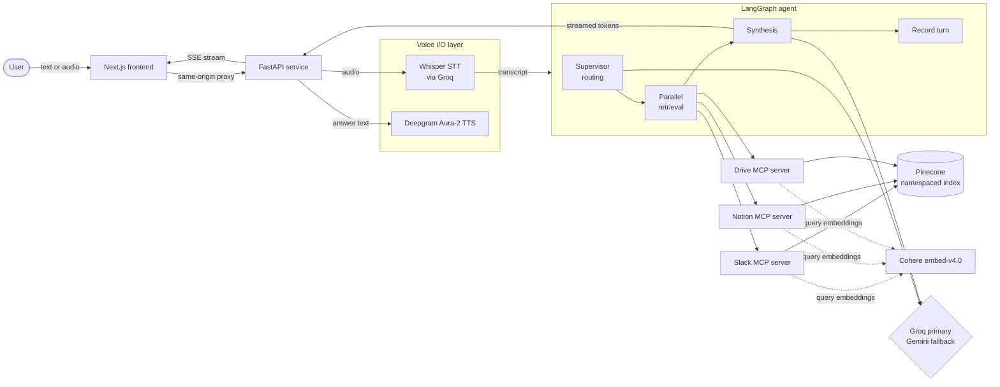
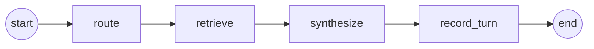

<div align="center">

# Enterprise KB Agent

**One question. Every source of truth.**

A multi-agent knowledge assistant that routes each question across Slack, Notion and Google Drive,
retrieves context with hybrid search, and streams back a single grounded answer — by text or by voice.

[](https://www.python.org/)
[](https://fastapi.tiangolo.com/)
[](https://langchain-ai.github.io/langgraph/)
[](https://nextjs.org/)
[](LICENSE)

[Overview](#overview) ·
[Architecture](#architecture) ·
[Getting started](#getting-started) ·
[API reference](#api-reference) ·
[Deployment](#deployment)

</div>

---

## Table of contents

- [Overview](#overview)
- [Features](#features)
- [Architecture](#architecture)
  - [System diagram](#system-diagram)
  - [Request lifecycle](#request-lifecycle)
  - [Agent graph](#agent-graph)
- [Tech stack](#tech-stack)
- [Repository structure](#repository-structure)
- [Getting started](#getting-started)
  - [Prerequisites](#prerequisites)
  - [Environment variables](#environment-variables)
  - [Backend setup](#backend-setup)
  - [Ingesting the knowledge base](#ingesting-the-knowledge-base)
  - [Running with Docker](#running-with-docker)
  - [Frontend setup](#frontend-setup)
- [API reference](#api-reference)
- [Frontend](#frontend)
- [Sample knowledge base](#sample-knowledge-base)
- [Testing](#testing)
- [Deployment](#deployment)
- [Design decisions](#design-decisions)
- [Limitations and roadmap](#limitations-and-roadmap)
- [License](#license)
- [Author](#author)

---

## Overview

Company knowledge rarely lives in one place. Announcements and incident threads sit in Slack,
policies and runbooks live in Notion, and pricing sheets, whitepapers and postmortems are stored in
Google Drive. Finding a complete answer usually means searching all three by hand.

Enterprise KB Agent removes that step. A user asks a question in plain language — typed or spoken —
and the system:

1. **Routes** the question with a supervisor agent that decides which sources are relevant and
   extracts structured filters such as channel, date range, page, folder or file type.
2. **Retrieves** context from the selected sources in parallel, each through its own
   [Model Context Protocol (MCP)](https://modelcontextprotocol.io/) tool server.
3. **Searches** a Pinecone vector index using Cohere embeddings combined with metadata filters.
4. **Synthesizes** a single answer with citations, using Groq as the primary model and Gemini as an
   automatic fallback.
5. **Streams** the answer token by token over server-sent events, and optionally speaks it back.

The repository contains both the FastAPI backend (the agent) and a Next.js frontend (a product page
and a streaming chat client).

---

## Features

| Capability | Description |
| --- | --- |
| **Multi-agent routing** | A LangGraph supervisor node selects only the sources a question needs and extracts per-source filters, so irrelevant systems are never queried. |
| **Parallel MCP retrieval** | Slack, Notion and Drive are each exposed as an independent MCP server. Selected sources are queried concurrently with `asyncio.gather`. |
| **Hybrid retrieval** | Semantic search over Cohere `embed-v4.0` vectors in Pinecone, narrowed by structured metadata filters (dates, channels, pages, folders, file types). |
| **Streaming responses** | Answers are streamed token by token from the graph (`stream_mode="custom"`) and forwarded to the client as server-sent events. |
| **Conversation memory** | A LangGraph checkpointer keyed by `thread_id` keeps conversation history, so follow-up questions such as "when did that take effect?" resolve correctly. |
| **Voice input and output** | Speech is transcribed with Whisper (via Groq); the final answer is synthesized to MP3 with Deepgram Aura-2 and returned in the same stream. |
| **LLM fallback resilience** | Both routing and synthesis try Groq first and transparently fall back to Gemini on rate limits or errors. The model actually used is reported with every answer. |
| **Robust error surfacing** | Any failure inside a stream is emitted as an `event: error` SSE message instead of a dropped connection. |

---

## Architecture

### System diagram



### Request lifecycle

A single `/chat` request moves through the following stages:

| Stage | Component | What happens |
| --- | --- | --- |
| 1. Query | FastAPI `/chat` | Accepts `{ question, thread_id? }`. A new `thread_id` is generated when none is supplied. |
| 2. Routing | `route_node` | The supervisor prompt (grounded with today's date and recent history) returns JSON: `{ "sources": [...], "filters": {...} }`. Source names are normalized (for example `"slacks"` to `"slack"`) so a wording slip never silently drops a source. |
| 3. Retrieval | `retrieve_node` | Calls `search_slack`, `search_notion` and/or `search_drive` concurrently through `langchain-mcp-adapters`. |
| 4. Search | MCP servers | Each server embeds the query with Cohere and queries its own Pinecone namespace with the extracted metadata filters. |
| 5. Synthesis | `synthesize_node` | Builds a grounded prompt from the retrieved context and the last three turns, then streams tokens through `get_stream_writer()`. |
| 6. Memory | `record_turn_node` | Appends the question and answer to the thread's history in the checkpointer. |
| 7. Completion | FastAPI | Emits a final `event: done` with routing decision, models used and per-stage timings. |

For `/voice-chat`, the uploaded audio is transcribed first (emitted as `event: transcript`), the
same graph runs on the transcript, and the final answer is converted to speech and returned as
base64 MP3 inside the `done` event.

### Agent graph



The graph is compiled once at application startup (FastAPI lifespan) together with the MCP tool
client and the checkpointer, so tool servers and models are not reloaded on every request.

---

## Tech stack

| Layer | Technology | Role |
| --- | --- | --- |
| Interface | Next.js 16 (App Router), TypeScript, Tailwind CSS 4, lucide-react | Product page and streaming chat client |
| API | FastAPI, Uvicorn | HTTP API with server-sent event streaming |
| Orchestration | LangGraph, LangChain, `langchain-mcp-adapters` | Stateful agent graph and tool loading |
| Tools | Model Context Protocol (`mcp`, FastMCP) | One tool server per knowledge source |
| Retrieval | Pinecone (serverless), Cohere `embed-v4.0` (1024 dimensions, cosine) | Vector storage, embeddings and metadata filtering |
| Language models | Groq (`qwen/qwen3.8-27b`), Google Gemini (`gemini-3.6-flash`) | Routing and synthesis with automatic fallback |
| Voice | Groq Whisper (`whisper-large-v3-turbo`), Deepgram Aura-2 (`aura-2-asteria-en`) | Speech-to-text and text-to-speech |
| Delivery | Docker, Docker Compose, Render | Containerized backend and hosting |

---

## Repository structure

```text
enterprise-kb-agent/
├── backend/
│   ├── app/
│   │   ├── main.py               # FastAPI app: /health, /chat, /voice-chat (SSE)
│   │   ├── graph.py              # LangGraph agent: route -> retrieve -> synthesize -> record_turn
│   │   ├── voice.py              # Whisper STT (Groq) and Deepgram TTS helpers
│   │   ├── config.py             # Environment configuration
│   │   ├── mcp_servers/
│   │   │   ├── slack_server.py   # search_slack(query, channel, date_from, date_to, top_k)
│   │   │   ├── notion_server.py  # search_notion(query, page, top_k)
│   │   │   └── drive_server.py   # search_drive(query, folder, filetype, top_k)
│   │   └── ingestion/
│   │       └── load_and_embed.py # Embeds the sample data and upserts it into Pinecone
│   ├── data/                     # Sample Slack, Notion and Drive datasets (JSON)
│   ├── test_*.py                 # Component and end-to-end test scripts
│   ├── Dockerfile
│   ├── requirements.txt
│   └── .env.example
├── frontend/
│   ├── app/
│   │   ├── page.tsx              # Product showcase page
│   │   ├── chat/page.tsx         # Chat interface
│   │   └── api/                  # Same-origin proxy routes: chat, voice-chat, health
│   ├── components/
│   │   ├── chat/                 # Chat UI, message rendering, audio playback
│   │   └── home/                 # Showcase page sections
│   └── lib/
│       ├── api.ts                # Fetch + ReadableStream SSE client
│       ├── proxy.ts              # Streaming pass-through to the backend
│       └── config.ts             # API base URL and links
├── docker-compose.yml
├── LICENSE
└── README.md
```

---

## Getting started

### Prerequisites

- Python 3.12
- Node.js 20 or later and npm
- Docker (optional, for containerized runs)
- API keys for Groq, Google Gemini, Cohere, Pinecone and Deepgram

### Environment variables

Create `backend/.env` from the template:

```bash
cp backend/.env.example backend/.env
```

| Variable | Required | Description |
| --- | --- | --- |
| `GROQ_API_KEY` | Yes | Primary LLM for routing and synthesis, and Whisper transcription |
| `GEMINI_API_KEY` | Yes | Fallback LLM for routing and synthesis |
| `COHERE_API_KEY` | Yes | Query and document embeddings (`embed-v4.0`) |
| `PINECONE_API_KEY` | Yes | Vector database access |
| `PINECONE_INDEX_NAME` | No | Index name, defaults to `enterprise-kb-agent` |
| `DEEPGRAM_API_KEY` | For voice | Text-to-speech for `/voice-chat` answers |

The frontend reads a single optional variable, set in `frontend/.env.local`:

| Variable | Default | Description |
| --- | --- | --- |
| `NEXT_PUBLIC_API_BASE_URL` | `https://enterprise-kb-agent.onrender.com` | Base URL of the FastAPI backend |

### Backend setup

```bash
cd backend
python -m venv venv

# Windows
venv\Scripts\activate
# macOS / Linux
source venv/bin/activate

pip install -r requirements.txt
uvicorn app.main:app --reload --port 8000
```

On startup the service loads the three MCP tool servers and compiles the graph. Once
`Startup complete: graph ready.` is logged, verify it with:

```bash
curl http://localhost:8000/health
# {"status":"ok"}
```

### Ingesting the knowledge base

The sample datasets must be embedded into Pinecone once before the agent can retrieve anything.
From the `backend` directory:

```bash
python app/ingestion/load_and_embed.py
```

The script creates the index if it does not exist (serverless, AWS `us-east-1`, 1024 dimensions,
cosine metric), upserts each dataset into its own namespace (`slack`, `notion`, `drive`), and runs a
retrieval smoke test per namespace.

### Running with Docker

```bash
docker compose up --build
```

The API is served on `http://localhost:8000` using the variables in `backend/.env`. The image
contains only the runtime application; sample data, tests and the ingestion script stay out of the
container because the vectors already live in Pinecone.

### Frontend setup

```bash
cd frontend
npm install
cp .env.local.example .env.local   # point NEXT_PUBLIC_API_BASE_URL at your backend
npm run dev
```

Open `http://localhost:3000` for the product page and `http://localhost:3000/chat` for the chat
interface.

---

## API reference

All streaming endpoints return `text/event-stream`. Every stream ends with exactly one `done` or
`error` event.

### `GET /health`

Liveness check.

```json
{ "status": "ok" }
```

### `POST /chat`

**Request**

```json
{
  "question": "What changed about pricing recently?",
  "thread_id": "optional - reuse the value from a previous done event"
}
```

**Response events**

| Event | Payload | Description |
| --- | --- | --- |
| *(unnamed)* | `{"token": "..."}` | One per streamed answer token, in order |
| `error` | `{"type": "...", "message": "..."}` | A failure occurred; the stream ends |
| `done` | See below | The answer is complete |

```json
{
  "thread_id": "8fc7d128-38ae-4290-a116-4ad69902ab99",
  "router_used": "groq",
  "decision": {
    "sources": ["slack"],
    "filters": { "slack": { "channel": "pricing", "date_from": null, "date_to": null } }
  },
  "synth_used": "groq",
  "routing_time": 0.28,
  "retrieval_time": 10.23,
  "synthesis_time": 0.6
}
```

Send the returned `thread_id` with the next question to continue the same conversation.

**Example**

```bash
curl -N -X POST http://localhost:8000/chat \
  -H "Content-Type: application/json" \
  -d '{"question": "How many days can I work remotely?"}'
```

```text
data: {"token": "You"}

data: {"token": " can"}

...

event: done
data: {"thread_id": "...", "router_used": "groq", "decision": {...}, ...}
```

### `POST /voice-chat`

**Request:** `multipart/form-data`

| Field | Type | Description |
| --- | --- | --- |
| `file` | audio file | Recorded question (for example WebM, MP3 or M4A) |
| `thread_id` | string, optional | Continue an existing conversation |

**Response events:** the same as `/chat`, plus:

| Event | Payload | Description |
| --- | --- | --- |
| `transcript` | `{"text": "..."}` | Sent first — what the user said |
| `done` | adds `transcript` and `answer_audio_base64` | The spoken answer as base64-encoded MP3 |

```bash
curl -N -X POST http://localhost:8000/voice-chat \
  -F "file=@question.mp3" \
  -F "thread_id=8fc7d128-38ae-4290-a116-4ad69902ab99"
```

---

## Frontend

The frontend is a Next.js App Router application with two pages.

**Product page (`/`)** presents the project: overview, an animated architecture flow, a
capabilities grid with live visual demos, the layered tech stack and a call to action.

**Chat (`/chat`)** is a fully working client for the API:

- Tokens render as they stream in, with a live cursor and lightweight formatting for lists and
  emphasis.
- Each answer shows tags for the sources that were queried, plus the model used and total latency
  (hover for per-stage timings).
- A microphone button records audio with the MediaRecorder API and posts it to `/voice-chat`. The
  transcript appears as "You said", and the spoken answer plays automatically.
- Every answer has a compact play and pause control. Voice answers play the backend's Deepgram audio;
  text answers are read aloud with the browser's speech synthesis.
- Errors from the stream are shown inline with a retry action, and a streaming answer can be stopped
  at any time.
- A connection indicator reports backend status, including cold starts on free hosting tiers.

**Streaming and CORS.** The browser `EventSource` API cannot send POST requests, so the client
parses the SSE stream manually with `fetch` and a `ReadableStream`. Because the backend does not
send CORS headers, the frontend calls same-origin route handlers (`/api/chat`, `/api/voice-chat`,
`/api/health`) that forward requests to `NEXT_PUBLIC_API_BASE_URL` and pipe the upstream stream
back without buffering.

---

## Sample knowledge base

The repository ships with a small, realistic dataset describing a fictional company, stored in
`backend/data/`.

| Source | File | Records | Metadata used for filtering |
| --- | --- | --- | --- |
| Slack | `slack_messages.json` | 24 messages across 7 channels | `channel`, `date` |
| Notion | `notion_pages.json` | 10 pages | `page_title` |
| Google Drive | `drive_docs.json` | 8 documents across 6 folders | `folder`, `filetype` |

Example questions that exercise different routing paths:

- *What changed about pricing recently?* — Slack, filtered to the pricing channel
- *How many days can I work remotely?* — Notion
- *What happened during the August 22 incident?* — Slack, Notion and Drive
- *What is our parental leave policy, and did engineering ship anything about it?* — Notion and Slack

---

## Testing

The backend includes standalone scripts that verify each layer independently before testing the
whole pipeline. Run them from the `backend` directory with the virtual environment active.

| Script | Scope |
| --- | --- |
| `test_all_keys.py` | Validates every API key and measures model latency |
| `test_mcp_servers.py` | Launches each MCP server over stdio and calls its tool directly |
| `test_mcp_tools_loading.py` | Confirms `langchain-mcp-adapters` loads all three tools |
| `test_supervisor_routing.py` | Routing decisions in isolation |
| `test_routing_to_retrieval.py` | Routing followed by real MCP retrieval |
| `test_synthesis.py` | Routing, multi-source retrieval and streamed synthesis |
| `test_voice_io.py` | Deepgram TTS to Whisper STT round trip |
| `test_chat_endpoint.py` | End-to-end `/chat` streaming, including multi-turn memory |
| `test_voice_chat_endpoint.py` | End-to-end `/voice-chat` with transcript, answer and audio |

The endpoint tests target `http://127.0.0.1:8000` by default. To run them against a deployed
instance, set `API_BASE_URL`:

```bash
# macOS / Linux
API_BASE_URL=https://enterprise-kb-agent.onrender.com python test_chat_endpoint.py

# Windows PowerShell
$env:API_BASE_URL = "https://enterprise-kb-agent.onrender.com"; python test_chat_endpoint.py
```

The graph module also includes a smoke test and a self-check for source-name normalization:

```bash
python app/graph.py
```

---

## Deployment

### Backend on Render

The backend is deployed as a Docker web service on Render at
`https://enterprise-kb-agent.onrender.com`.

1. Create a new **Web Service** from this repository with `backend` as the root directory and the
   **Docker** runtime.
2. Add the environment variables listed above.
3. Render injects `$PORT`; the container's start command binds Uvicorn to it automatically.

On the free tier the service sleeps when idle, so the first request after a pause can take up to a
minute while it starts.

### Frontend

The frontend deploys to any Node.js host that supports Next.js route handlers, such as Vercel or
Render. Set `NEXT_PUBLIC_API_BASE_URL` to the backend URL. Long answers stream through the proxy
routes, which declare `maxDuration = 300`; make sure the hosting plan allows function durations long
enough for cold starts and voice responses.

---

## Design decisions

- **One MCP server per source.** Each knowledge source is isolated behind its own tool interface.
  Replacing the sample data with the real Slack, Notion or Google Drive APIs changes only that
  server, not the agent.
- **Structured routing over free-form tool calling.** The supervisor returns an explicit JSON
  decision, which makes routing observable (it is returned in every `done` event), testable in
  isolation and cheap to run.
- **Namespaces instead of separate indexes.** All sources share one Pinecone index with a namespace
  each, keeping infrastructure minimal while preserving per-source filtering.
- **Groq first, Gemini second.** Groq was chosen as the primary for latency and free-tier
  reliability observed during testing; Gemini provides an independent fallback for both routing and
  synthesis.
- **Errors as events.** Streaming generators catch exceptions and emit `event: error`, so clients
  always receive an explanation rather than a dropped connection.
- **Graph built once.** The compiled graph, MCP client and checkpointer are created in the FastAPI
  lifespan handler and reused across requests.

---

## Limitations and roadmap

- Conversation memory uses LangGraph's in-memory `MemorySaver`, so threads reset when the service
  restarts. A persistent checkpointer (PostgreSQL or Redis) is the natural next step.
- Retrieval runs over a curated sample dataset. Production use would replace the MCP servers'
  backing data with live Slack, Notion and Google Drive connectors plus scheduled re-ingestion.
- The API has no authentication or rate limiting and is intended for demonstration.
- Answers cite sources in text; exposing retrieved passages as structured citations in the `done`
  event would allow richer source previews in the client.

---

## License

This project is licensed under the Apache License 2.0. See [LICENSE](LICENSE) for details.

---

## Author

Designed and developed by **Jamshed** — [github.com/JamshedAli18](https://github.com/JamshedAli18).
